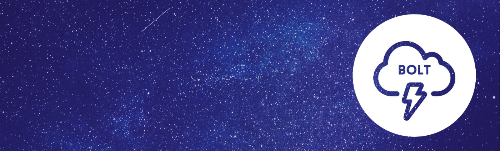
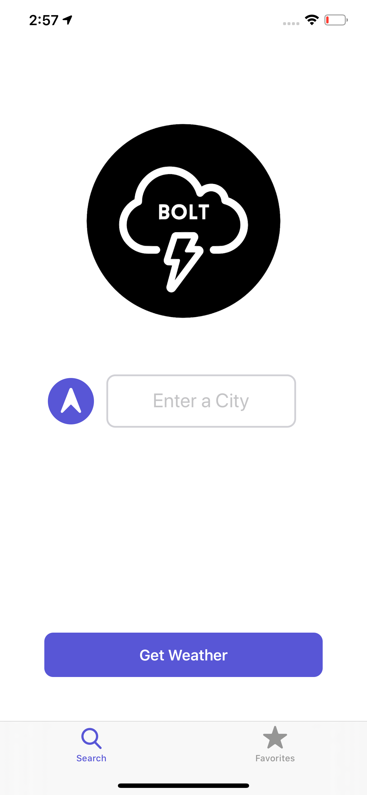
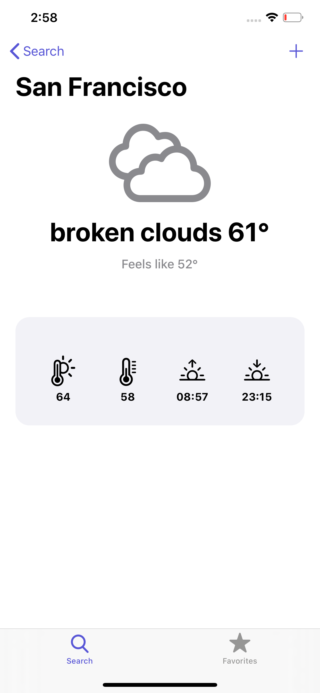
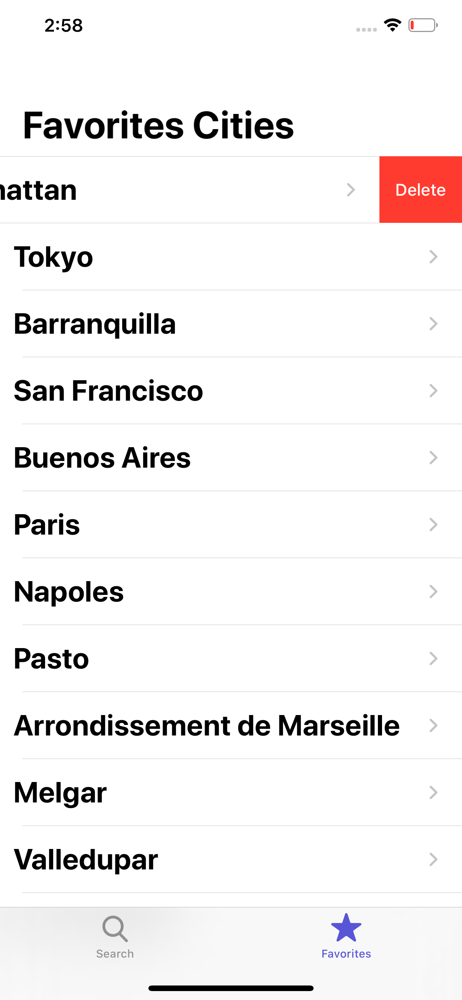
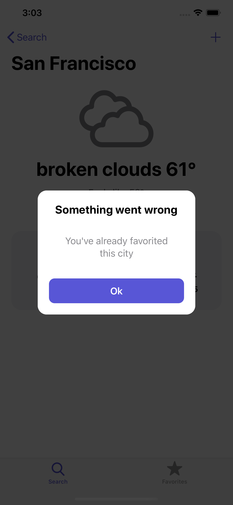

# My Portfolio

## My Goal

I am in pursuit of an iOS junior developer position. After a year of intensive iOS development courses, I am now showcasing my capabilities and knowledge acquired in the last few months. I am currently working on iOS app prototypes and sharing them with the internet in hopes of taking the next step in my career.

## The App

BOLT is an iOS weather app that retrieves the temperature and conditions of either your current location or any city in the world that you type in. Furthermore, you can save or remove your favorite cities from your list and check their conditions at any time.  The weather information its queried from an open source weather service. 

## Swift features in this app

* Programmatic UI (no story board) show casing UITabBar and UINavigation Controllers
* Implementation of own designed dark mode assets
* Custom reusable objects (Labels, Buttons, Alerts, Cells, Views)
* Model View Controller type of model
* Network-API Call, Json decoder, Data Model
* User defaults
* No third-party libraries

Special thanks to London App Brewery [www.appbrewery.co](https://www.appbrewery.co/) and Sean Allen [seanallen.co](https://seanallen.co/) for their amazing iOS courses. This portfolio puts in practice some of their teachings. 

-----------------------------------------

